# 🏗️ compass-compute Architecture

> **Deep dive into the codebase structure and design patterns**

## Overview

compass-compute is built with a layered architecture that separates concerns and enables easy extension. The system follows a **fact-based evaluation model** where metrics are computed through a series of data extraction, validation, and aggregation operations.

## Architecture Diagram

```mermaid
graph TB
    %% CLI Layer
    subgraph CLI["🖥️ CLI Layer (cmd/)"]
        Main["main.go<br/>• Root command setup<br/>• Flag parsing<br/>• Environment validation"]
        Compute["compute.go<br/>• Compute command<br/>• Component processing<br/>• Verbose logging"]
    end

    %% Business Logic Layer
    subgraph Business["🧠 Business Logic (internal/compute/)"]
        ProcessComp["compute.go<br/>• Process() - main workflow<br/>• Component lookup<br/>• Repository cloning<br/>• Metric evaluation<br/>• Result submission"]
    end

    %% Services Layer
    subgraph Services["🔧 Services Layer (internal/services/)"]
        Models["models.go<br/>• Fact struct<br/>• Metric struct<br/>• Component struct<br/>• MetricDefinition"]
        
        Compass["compass.go<br/>• CompassService<br/>• GetComponent()<br/>• PutMetric()<br/>• GraphQL queries"]
        
        Prometheus["prometheus_service.go<br/>• PrometheusClient<br/>• Query() / QueryRange()<br/>• AWS SigV4 auth<br/>• Prometheus API"]
        
        GitHub["github.go<br/>• GitHubCloner<br/>• Clone repositories<br/>• Setup metric directories<br/>• Git operations"]
        
        MetricParser["metrics.go<br/>• MetricsParser<br/>• Parse YAML files<br/>• Load metric definitions<br/>• File discovery"]
        
        Utils["utils.go<br/>• SigV4RoundTripper<br/>• AWS authentication<br/>• HTTP request signing<br/>• URL encoding"]
        
        Config["config.go<br/>• Configuration constants<br/>• Default paths<br/>• Environment handling"]
    end

    %% Facts Engine
    subgraph Facts["⚙️ Facts Engine (internal/facts/)"]
        Evaluator["evaluator.go<br/>• FactEvaluator<br/>• EvaluateMetric()<br/>• Dependency resolution<br/>• Fact orchestration"]
        
        Extractor["extractor.go<br/>• Data extraction<br/>• GitHub source<br/>• API source<br/>• Prometheus source<br/>• Custom sources"]
        
        Processor["processor.go<br/>• processExtract()<br/>• processValidate()<br/>• processAggregate()<br/>• Custom processors"]
        
        Appliers["appliers.go<br/>• Rule application<br/>• JSONPath processing<br/>• Regex validation<br/>• Custom rules"]
        
        Helpers["helpers.go<br/>• Placeholder substitution<br/>• Dependency checking<br/>• Type conversion<br/>• TOML parsing"]
        
        Utils2["utils.go<br/>• convertToFloat64()<br/>• convertToBool()<br/>• Type utilities"]
    end

    %% External Systems
    subgraph External["🌐 External Systems"]
        CompassAPI["Atlassian Compass<br/>• Component lookup<br/>• Metric submission<br/>• GraphQL API"]
        
        GitHubAPI["GitHub API<br/>• Repository access<br/>• File content<br/>• Authentication"]
        
        PrometheusAPI["AWS Prometheus<br/>• Metric queries<br/>• Time series data<br/>• SigV4 auth"]
        
        LocalFS["Local File System<br/>• Cloned repositories<br/>• Metric definitions<br/>• Cache storage"]
    end

    %% Data Flow
    Main --> Compute
    Compute --> ProcessComp
    
    ProcessComp --> Compass
    ProcessComp --> GitHub
    ProcessComp --> Evaluator
    
    Evaluator --> Extractor
    Evaluator --> Processor
    Evaluator --> Appliers
    
    Extractor --> Helpers
    Processor --> Appliers
    Appliers --> Utils2
    
    %% Service Dependencies
    Compass --> Models
    Prometheus --> Utils
    GitHub --> Config
    MetricParser --> Models
    
    %% External Connections
    Compass -.->|GraphQL/REST| CompassAPI
    GitHub -.->|Git Clone| GitHubAPI
    GitHub -.->|File Operations| LocalFS
    Prometheus -.->|PromQL| PrometheusAPI
    Extractor -.->|File Read| LocalFS
    MetricParser -.->|YAML Parse| LocalFS

    %% Fact Types Flow
    subgraph FactFlow["📊 Fact Processing Flow"]
        Extract["Extract Facts<br/>• GitHub files<br/>• API calls<br/>• Prometheus queries"]
        
        Validate["Validate Facts<br/>• Regex matching<br/>• Dependency checking<br/>• Data validation"]
        
        Aggregate["Aggregate Facts<br/>• Mathematical ops<br/>• Logical ops<br/>• Result combination"]
        
        Extract --> Validate
        Validate --> Aggregate
    end

    Processor --> Extract
    Extract --> Validate
    Validate --> Aggregate

    %% Extension Points
    subgraph Extensions["🔌 Extension Points"]
        CustomFacts["Custom Fact Types<br/>• processCustom()<br/>• Database queries<br/>• Kubernetes ops<br/>• Security scans"]
        
        CustomSources["Custom Data Sources<br/>• extractCustom()<br/>• Elasticsearch<br/>• S3 buckets<br/>• Message queues"]
        
        CustomRules["Custom Rules<br/>• applyCustomRule()<br/>• Math operations<br/>• NLP processing<br/>• AI analysis"]
    end

    Processor -.->|Extension| CustomFacts
    Extractor -.->|Extension| CustomSources
    Appliers -.->|Extension| CustomRules

    %% Styling
    classDef cliClass fill:#e1f5fe,stroke:#01579b,stroke-width:2px
    classDef businessClass fill:#f3e5f5,stroke:#4a148c,stroke-width:2px
    classDef servicesClass fill:#e8f5e8,stroke:#1b5e20,stroke-width:2px
    classDef factsClass fill:#fff3e0,stroke:#e65100,stroke-width:2px
    classDef externalClass fill:#fce4ec,stroke:#880e4f,stroke-width:2px
    classDef extensionClass fill:#f1f8e9,stroke:#33691e,stroke-width:2px
    classDef flowClass fill:#e0f2f1,stroke:#00695c,stroke-width:2px

    class Main,Compute cliClass
    class ProcessComp businessClass
    class Models,Compass,Prometheus,GitHub,MetricParser,Utils,Config servicesClass
    class Evaluator,Extractor,Processor,Appliers,Helpers,Utils2 factsClass
    class CompassAPI,GitHubAPI,PrometheusAPI,LocalFS externalClass
    class CustomFacts,CustomSources,CustomRules extensionClass
    class Extract,Validate,Aggregate flowClass
```



## Architectural Layers

### 🖥️ CLI Layer (`cmd/`)

**Purpose**: Command-line interface and user interaction

| File | Responsibilities |
|------|------------------|
| `main.go` | • Root command setup<br/>• Flag parsing and validation<br/>• Environment variable checking<br/>• Application entry point |
| `compute.go` | • Compute command implementation<br/>• Component name validation<br/>• Verbose logging configuration<br/>• Error handling and user feedback |

**Key Functions**:
- `validateEnvironmentVariables()` - Ensures required env vars are set
- `computeCmd.RunE` - Main command execution logic

### 🧠 Business Logic (`internal/compute/`)

**Purpose**: Core business workflow orchestration

| File | Responsibilities |
|------|------------------|
| `compute.go` | • Main processing workflow<br/>• Component lookup coordination<br/>• Repository management<br/>• Metric evaluation orchestration<br/>• Result submission |

**Key Functions**:
- `Process()` - Main workflow for single component
- `ProcessAll()` - Batch processing for multiple components

**Workflow**:
1. Lookup component in Compass
2. Clone necessary repositories
3. Discover and parse metric definitions
4. Evaluate facts for each metric
5. Submit results to Compass

### 🔧 Services Layer (`internal/services/`)

**Purpose**: External system integrations and data models

#### Core Models (`models.go`)
```go
type Fact struct {
    ID              string      // Unique identifier
    Type            string      // extract, validate, aggregate
    Source          string      // github, api, prometheus
    Rule            string      // Processing rule
    Result          interface{} // Computed result
    Done            bool        // Execution status
    DependsOn       []string    // Dependency list
    // ... additional fields
}

type MetricDefinition struct {
    APIVersion string
    Kind       string
    Metadata   struct {
        Name          string
        ComponentType []string
        Facts         []Fact
    }
    Spec struct {
        Name        string
        Description string
    }
}
```

#### Compass Integration (`compass.go`)
```go
type CompassService struct {
    token   string
    cloudID string
    client  *http.Client
}

// Key methods:
// GetComponent() - Retrieve component metadata
// PutMetric() - Submit metric values
// GetMetricFacts() - Get metric definitions
// graphqlRequest() - Execute GraphQL queries
```

#### Prometheus Integration (`prometheus_service.go`)
```go
type PrometheusClient struct {
    api    v1.API
    region string
}

// Key methods:
// Query() - Instant queries
// QueryRange() - Time-series queries
// Includes AWS SigV4 authentication
```

#### GitHub Operations (`github.go`)
```go
type GitHubCloner struct {
    token string
}

// Key methods:
// Clone() - Repository cloning
// SetupMetricDirectory() - Metric source setup
// Support for local paths and git URLs
```

### ⚙️ Facts Engine (`internal/facts/`)

**Purpose**: Metric evaluation and fact processing

#### Main Evaluator (`evaluator.go`)
```go
type FactEvaluator struct {
    repoPath          string
    prometheusService *services.PrometheusService
}

// Key functions:
// EvaluateMetric() - Main evaluation orchestrator
// processFact() - Individual fact processing
// Dependency resolution and cycle detection
```

**Evaluation Flow**:
1. Parse fact dependencies
2. Execute facts in dependency order
3. Apply processing rules
4. Return final result

#### Data Extraction (`extractor.go`)
**Sources Supported**:
- **GitHub**: File content, repository search
- **API**: REST endpoints with authentication
- **Prometheus**: PromQL queries with AWS auth
- **Custom**: Extension point for new sources

```go
// Key functions:
// extractFromGitHub() - File operations
// extractFromAPI() - HTTP requests
// extractFromPrometheus() - Metric queries
// extractCustom() - Extension point
```

#### Fact Processing (`processor.go`)
**Fact Types**:
- **Extract**: Data collection from sources
- **Validate**: Data quality checks
- **Aggregate**: Result combination

```go
// Key functions:
// processExtract() - Data extraction workflow
// processValidate() - Validation logic
// processAggregate() - Result aggregation
```

#### Rule Application (`appliers.go`)
**Rules Supported**:
- **JSONPath**: JSON data extraction
- **Regex**: Pattern matching
- **Search**: Text search operations
- **Custom**: Extension point for new rules

```go
// Key functions:
// applyJSONPath() - JSON processing
// applyRule() - Rule dispatcher
// applyCustomRule() - Extension point
```

## Data Flow

### 1. Component Processing Flow
```
CLI Input → Validate Environment → Lookup Component → Clone Repos → Parse Metrics → Evaluate Facts → Submit Results
```

### 2. Fact Evaluation Flow
```
Load Facts → Resolve Dependencies → Execute in Order → Apply Rules → Combine Results
```

### 3. Data Extraction Flow
```
Fact Definition → Source Selection → Data Retrieval → Rule Application → Result Storage
```

## Extension Points

### 🔌 Adding Custom Fact Types

**Location**: `internal/facts/evaluator.go` → `processCustom()`

```go
func (fe *FactEvaluator) processCustom(ctx context.Context, fact *services.Fact, factMap map[string]*services.Fact) error {
    switch strings.ToLower(fact.Type) {
    case "kubernetes":
        return fe.processKubernetes(ctx, fact)
    case "database":
        return fe.processDatabase(ctx, fact)
    // Add your custom fact type here
    default:
        return fmt.Errorf("unknown fact type: %s", fact.Type)
    }
}
```

### 🌐 Adding Custom Data Sources

**Location**: `internal/facts/extractor.go` → `extractCustom()`

```go
func (fe *FactEvaluator) extractCustom(ctx context.Context, fact *services.Fact) ([]byte, error) {
    switch strings.ToLower(fact.Source) {
    case "elasticsearch":
        return fe.extractFromElasticsearch(ctx, fact)
    case "s3":
        return fe.extractFromS3(ctx, fact)
    // Add your custom source here
    default:
        return nil, fmt.Errorf("unsupported source: %s", fact.Source)
    }
}
```

### ⚙️ Adding Custom Processing Rules

**Location**: `internal/facts/appliers.go` → `applyCustomRule()`

```go
func (fe *FactEvaluator) applyCustomRule(fact *services.Fact, data []byte) (interface{}, error) {
    switch strings.ToLower(fact.Rule) {
    case "math":
        return fe.applyMath(fact, data)
    case "nlp":
        return fe.applyNLP(fact, data)
    // Add your custom rule here
    default:
        return string(data), nil
    }
}
```

## Design Patterns

### 1. **Dependency Injection**
Services are injected into processors, enabling easy testing and modularity.

### 2. **Strategy Pattern**
Different fact types, sources, and rules use strategy pattern for extensibility.

### 3. **Chain of Responsibility**
Fact processing flows through a chain of processors and appliers.

### 4. **Factory Pattern**
Service creation follows factory patterns with configuration.

### 5. **Template Method**
Common processing workflows with customizable steps.

## Configuration Management

### Environment Variables
```bash
# Required
COMPASS_API_TOKEN     # Compass authentication
COMPASS_CLOUD_ID      # Compass instance
GITHUB_TOKEN          # GitHub access

# Optional
AWS_REGION           # For Prometheus
AWS_ROLE             # For IAM role assumption
METRIC_DIR           # Custom metric source
```

### Configuration Constants (`config.go`)
```go
const (
    CatalogRepo            = "of-catalog"
    GitHubOrg              = "motain"
    MetricPath             = "config/grading-system"
    CompassBaseURL         = "https://onefootball.atlassian.net/gateway/api"
    ServiceSlugPrefix      = "svc-"
    LocalBasePath          = "./repos/"
)
```

## Error Handling Strategy

### 1. **Graceful Degradation**
- Continue processing other metrics if one fails
- Log warnings for non-critical errors
- Return partial results when possible

### 2. **Contextual Errors**
```go
return fmt.Errorf("failed to process fact %s: %w", fact.ID, err)
```

### 3. **Retry Logic**
- HTTP requests include retry mechanisms
- Temporary failures are handled gracefully

## Testing Architecture

### Unit Tests
- Each component has isolated unit tests
- Mock external dependencies
- Test error conditions and edge cases

### Integration Tests
- Test complete workflows
- Use test environments
- Validate external integrations

### End-to-End Tests
```bash
# Test complete workflow
./compass-compute compute test-service --verbose
```

## Performance Considerations

### 1. **Concurrent Processing**
- Facts are processed in dependency order
- Independent facts can run concurrently
- HTTP requests use connection pooling

### 2. **Caching**
- Repository cloning is cached locally
- Metric definitions are parsed once
- HTTP responses can be cached

### 3. **Resource Management**
- Proper cleanup of resources
- Context-based cancellation
- Memory-efficient processing

## Security Considerations

### 1. **Authentication**
- All external APIs require proper authentication
- Tokens are passed via environment variables
- AWS SigV4 for Prometheus access

### 2. **Input Validation**
- All user inputs are validated
- URL parsing prevents injection
- File paths are sanitized

### 3. **Secrets Management**
- No secrets in code
- Environment variables for sensitive data
- Proper token handling

## Monitoring and Observability

### 1. **Logging**
- Structured logging throughout
- Verbose mode for debugging
- Error context preservation

### 2. **Metrics**
- Processing time tracking
- Success/failure rates
- Resource usage monitoring

### 3. **Debugging**
- Request/response logging
- Fact evaluation tracing
- Dependency graph visualization

## Future Enhancements

### 1. **Plugin System**
- Dynamic extension loading
- Configuration-driven extensions
- Plugin marketplace

### 2. **Caching Layer**
- Redis/Memcached integration
- Smart cache invalidation
- Performance optimization

### 3. **Parallel Processing**
- Component-level parallelization
- Distributed processing
- Batch optimization

### 4. **Web Interface**
- Metric visualization
- Real-time processing
- Configuration management

---

## Quick Reference

### Key Files to Modify
| What You Want | File to Modify | Function |
|---------------|----------------|----------|
| New fact type | `internal/facts/evaluator.go` | `processCustom()` |
| New data source | `internal/facts/extractor.go` | `extractCustom()` |
| New processing rule | `internal/facts/appliers.go` | `applyCustomRule()` |
| New service integration | `internal/services/` | Create new service file |

### Common Extension Patterns
```go
// Custom fact type
case "mytype":
    return fe.processMyType(ctx, fact)

// Custom data source  
case "mysource":
    return fe.extractFromMySource(ctx, fact)

// Custom rule
case "myrule":
    return fe.applyMyRule(fact, data)
```

Ready to start coding? Check out the [Extensions Guide](extensions.md) for hands-on examples.